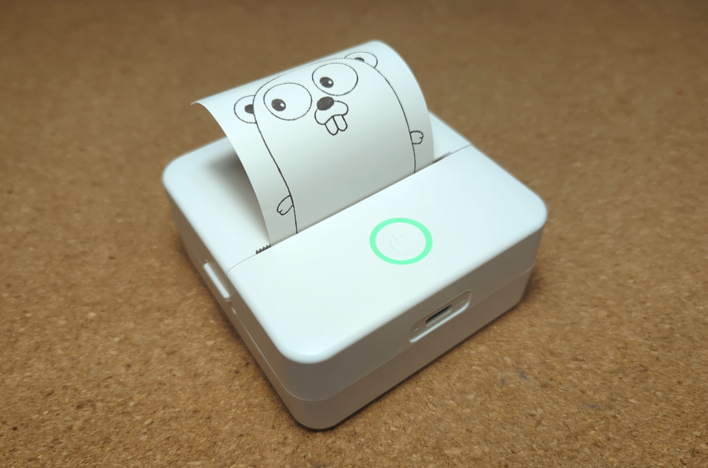

go-catprinter is a driver and CLI application that allows you to use some BLE printers, known as "cat printers", on Linux and MacOS, without needing to use the official app.

# Documentation

## CLI

Grab a binary from the [Releases](https://git.massivebox.net/massivebox/go-catprinter/releases) page. Use `./catprinter --help` for help.

- Basic example with provided MAC: `./catprinter --mac 41:c2:6f:0f:90:c7 --image ./gopher.png`
- Basic example with auto discovery by name: `./catprinter --name X6h --image ./gopher.png`

If it complains about needing more permissions, use

```
sudo setcap 'cap_net_raw,cap_net_admin+eip' ./catprinter
```

to avoid needing root permissions.

## Driver

For extensive documentation, please consult the [Go Reference](https://pkg.go.dev/git.massivebox.net/massivebox/go-catprinter). Check the `examples/` directory for examples:

- `examples/00-knownMac.go`: Shows how to connect to a printer by its MAC address and print a file
- `examples/01-unknownMac.go`: Shows how to connect to a printer by its name address and print a file
- `examples/02-options.go`: Shows how `PrinterOptions` can be used to create a rich printing experience with previews and user interaction

# Information

## Printer compatibility

This software should be compatible with printers whose official apps are [iPrint](https://play.google.com/store/apps/details?id=com.frogtosea.iprint&hl=en_US&gl=US), [Tiny Print](https://play.google.com/store/apps/details?id=com.frogtosea.tinyPrint&hl=en_US&gl=US) and similar.
Probably more printers work, but it's hard to tell with how fragmented the ecosystem is. Some printers with these apps might not work. The project takes no responsibility as per the LICENSE.

The project's main developer uses a X6h (the one in the top of the README). It can be found in AliExpress bundles for around ~€8.

## Thanks to

- [rbaron/catprinter](https://github.com/rbaron/catprinter) and [NaitLee/Cat-Printer](https://github.com/NaitLee/Cat-Printer), for providing most of the printer commands and inspiration for the project
- Shenzhen Frog To Sea Technology Co.,LTD
- Everyone who contributed, tested or used this software!

## Alternatives

- [NaitLee/Cat-Printer](https://github.com/NaitLee/Cat-Printer) - the cat printer central, with a CLI application, a web UI, CUPS/IPP support and an Android app. The code is a bit more cluttered, but it works well.
- [rbaron/catprinter](https://github.com/rbaron/catprinter) - simple CLI application for cat printers with batteries included, written in Python with code that's easy to understand.
- [NaitLee/kitty-printer](NaitLee/kitty-printer) - a web app for cat printers which leverages Web Bluetooth
- [jhbruhn/catprint-rs](jhbruhn/catprint-rs) - a driver for cat printers with a basic CLI utility, written in Rust
